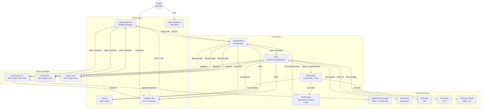
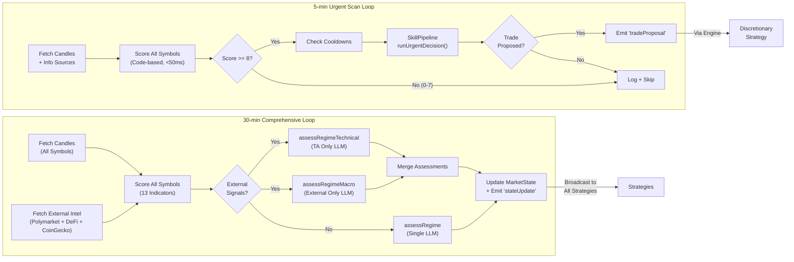
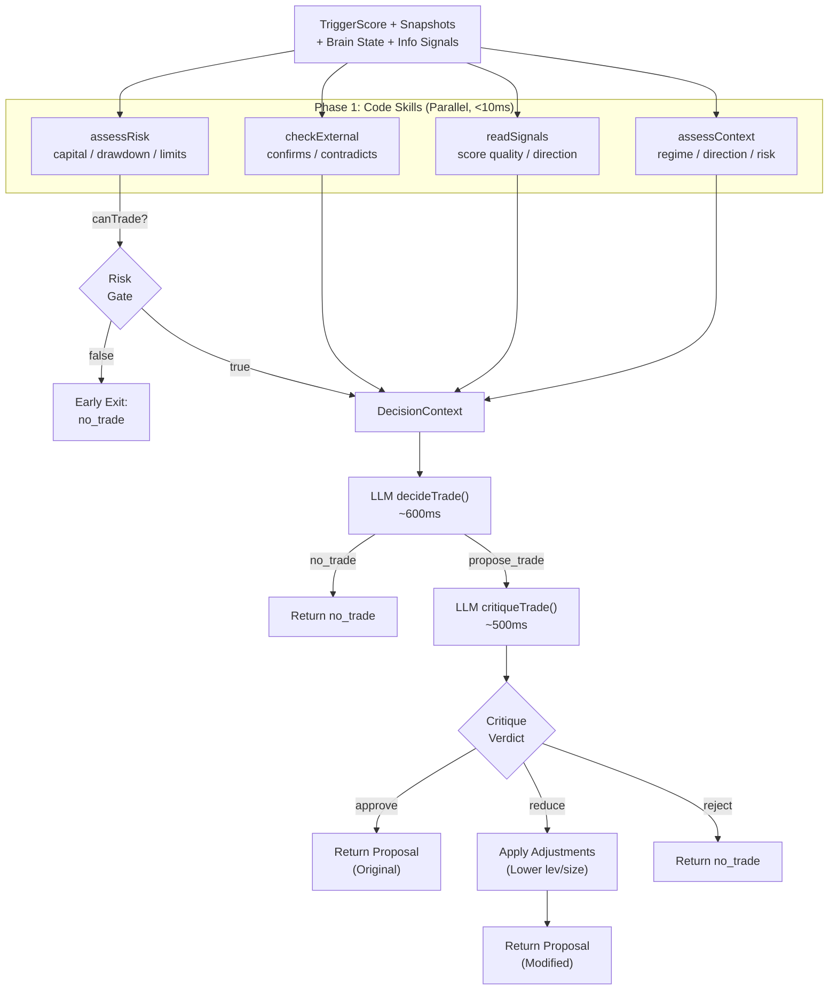
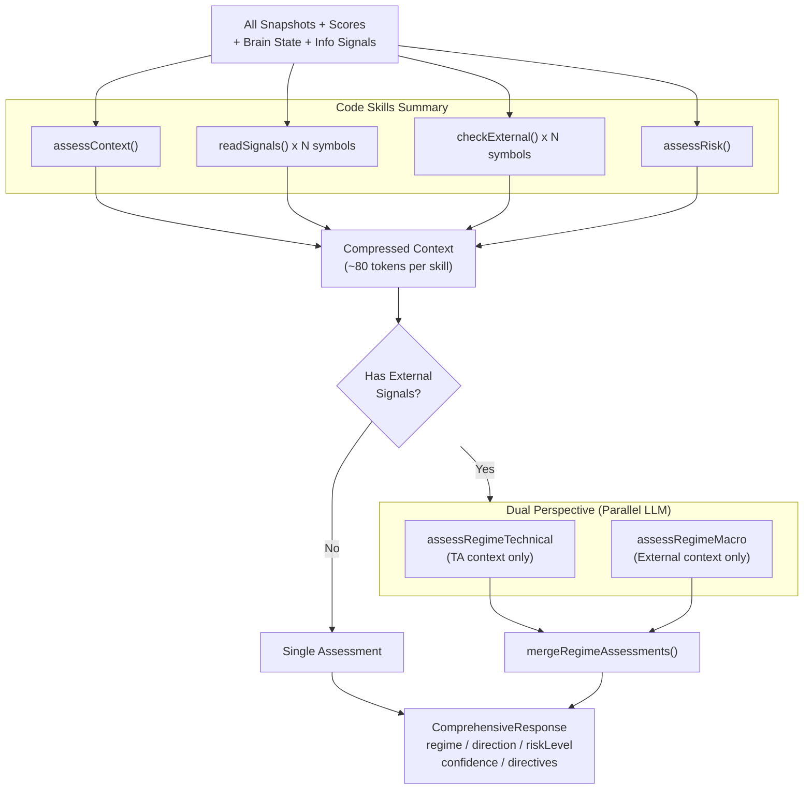
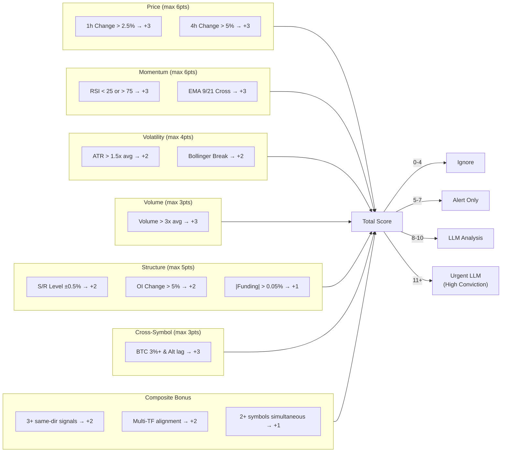
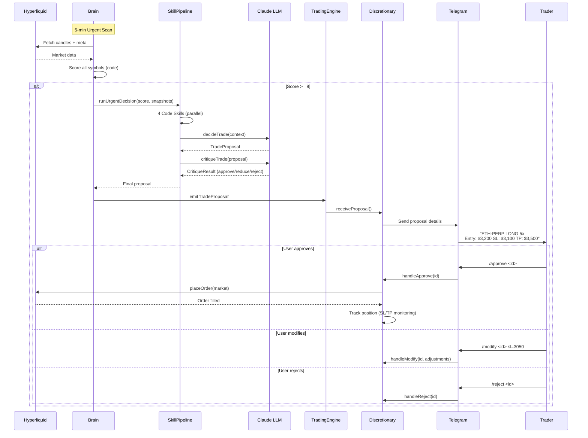
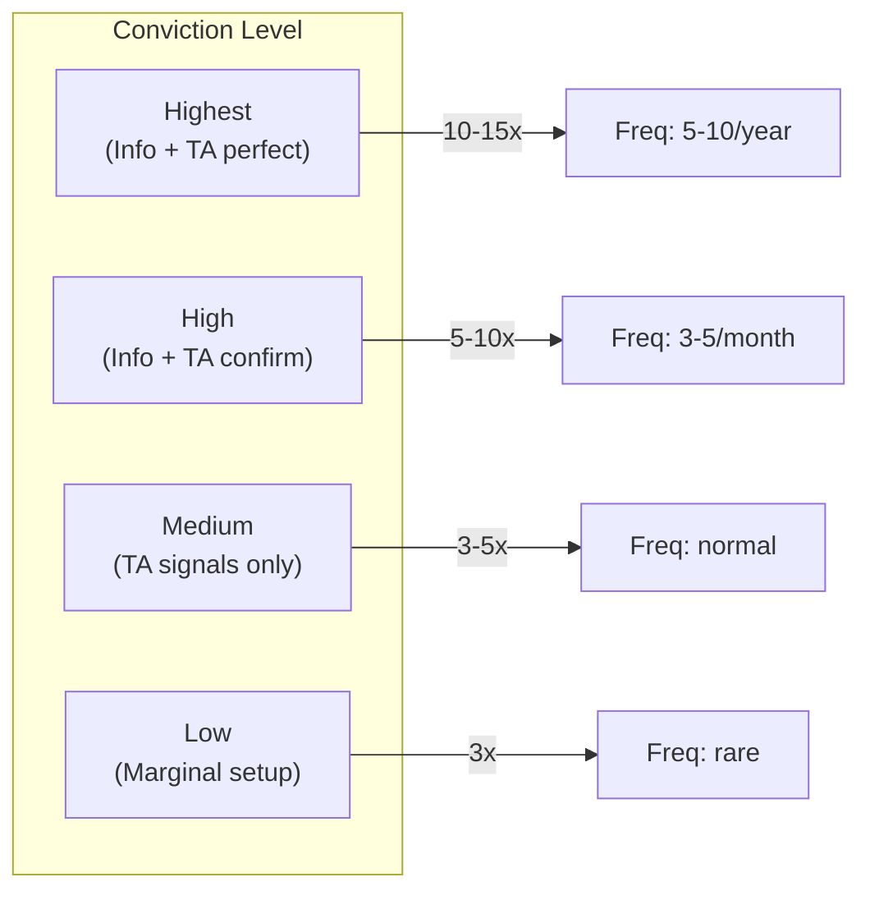
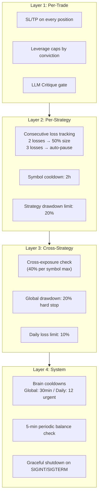
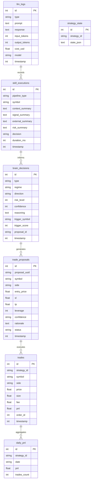
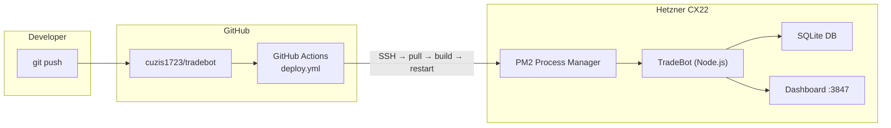

# TradeBot System Architecture

## High-Level Overview



---

## Brain Dual-Loop Architecture

Brain은 두 개의 독립 루프로 시장을 분석합니다.



---

## Skill Pipeline Detail

SkillPipeline은 Code Skills(결정론적)과 LLM Skills(확률적)을 조합합니다.

### Urgent Decision Pipeline (5-min trigger, score >= 8)



### Comprehensive Assessment Pipeline (30-min)



---

## Scorer: 13 Indicators



---

## Trade Execution Flow (Discretionary)



---

## Strategy Capital Allocation

```
Total Capital: $1,000
┌──────────────────────────────────────────────────────────────┐
│ Discretionary v3 (55%)  │ Momentum (25%) │ Equity │ Buffer │
│        $550              │     $250       │ $100   │ $100   │
│ Semi-auto, Info+TA      │ Auto, EMA/RSI  │ Auto   │ Reserve│
│ Lev: 3-15x by conviction│ Lev: 3x fixed  │ Lev:3x │        │
└──────────────────────────────────────────────────────────────┘
```

### Leverage Policy by Conviction



---

## Risk Management Layers



---

## Data Persistence (SQLite)



---

## Component Communication Summary

| From | To | Method | Data |
|------|-----|--------|------|
| Engine | Strategies | `strategy.setMarketState()` | MarketState (directives) |
| Engine | Strategies | `strategy.start(capital)` | Allocated capital |
| Engine | RiskManager | `risk.checkSignal()` | Trade signals |
| Engine | RiskManager | `risk.checkGlobalDrawdown()` | Portfolio value |
| Brain | Engine | EventEmitter `'stateUpdate'` | MarketState |
| Brain | Engine | EventEmitter `'tradeProposal'` | TradeProposal |
| Brain | Engine | EventEmitter `'alert'` | Alert message |
| Brain | SkillPipeline | `pipeline.runUrgentDecision()` | Score + snapshots |
| Brain | SkillPipeline | `pipeline.runComprehensiveAssessment()` | All data |
| SkillPipeline | LLMAdvisor | `decideTrade()` / `critique()` | Compressed context |
| Telegram | Discretionary | `handleApprove()` / `handleReject()` | Proposal ID |
| Discretionary | Telegram | Callback `onProposal` | Formatted proposal |
| All | SQLite | `getDb()` singleton | Trades, decisions, logs |
| All | HyperliquidClient | `getHyperliquidClient()` singleton | Orders, prices, candles |

---

## Deployment Architecture



| Component | Detail |
|-----------|--------|
| VPS | Hetzner CX22 (2 vCPU, 4GB RAM, 40GB SSD) |
| OS | Ubuntu 24.04 |
| Runtime | Node.js 22+ / TypeScript 5 (strict, ESM) |
| Process | PM2 (`ecosystem.config.cjs`) |
| CI/CD | GitHub Actions (push to branch triggers SSH deploy) |
| DB | SQLite WAL mode (`data/tradebot.db`) |
